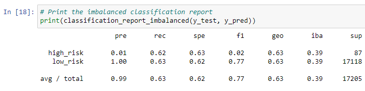

# Credit_Risk_Analysis

## Overview
The purpose of this analysis was to employ different techniques to train and evaluate models with unbalanced classes for credit risk analysis. This is because credit risk is an inherently unbalanced classification problem, as good loans easily outnumber risky loans. First, the data was oversampled using the RandomOverSampler and SMOTE algorithms, and then undersampled using the ClusterCentroids algorithm. Afterwards, a combinatorial approach of over- and undersampling using the SMOTEENN algorithm was implemented. Next, the usuge of the BalancedRandomForestClassifier and EasyEnsembleClassifier machine learning models that reduce bias are compared to predict credit risk. Finally, the performance of these models were evaluated and a recommendation was made on whether they should be used to predict credit risk.

## Results
### Naive Random Oversampling
- Balanced Accuracy score: 0.6471540342692306
- Precision score: High Risk = 0.01 | Low Risk = 1.00
- Recall score: High Risk = .62 | Low Risk = .67

### SMOTE Oversampling
- Balanced Accuracy score: 0.6251596424010217
- Precision score: High Risk = 0.01 | Low Risk = 1.00
- Recall score: High Risk = .62 | Low Risk = .63

### Undersampling
- Balanced Accuracy score: 0.6251596424010217
- Precision score: High Risk = 0.01 | Low Risk = 1.00
- Recall score: High Risk = .59 | Low Risk = .44

### Combination (Over and Under) Sampling
- Balanced Accuracy score: 0.5107398543980726
- Precision score: High Risk = 0.01 | Low Risk = 1.00
- Recall score: High Risk = .70 | Low Risk = .58

### Balanced Random Forest Classifier
- Balanced Accuracy score: 0.7877672625306695
- Precision score: High Risk = 0.04 | Low Risk = 1.00
- Recall score: High Risk = .67 | Low Risk = .91

### Easy Ensemble AdaBoost Classifier
- Balanced Accuracy score: 0.925427358175101
- Precision score: High Risk = 0.07 | Low Risk = 1.00
- Recall score: High Risk = .91 | Low Risk = .94

## Summary
In regards to balanced accuracy, this metric is measured between 0 and 1. The model with the an accuracy score closest to 1 would be considered the best machine learning model for this metric. In this case, the Easy Ensemble AdaBoost Classifier held the highest balanced accuracy score at nearly 0.93. No other models came close to this accuracy score. The Combination (Over and Under) Sampling model held the lowest balanced accuracy score.

The precision values for all models were similar. The precision scores for all models showed low scores for high-risk loans and high scores for low-risk loans. 

The recall score ranges between 0 and 1, with numbers closer to 1 indicating the better model. Under this metric, the Easy Ensemble AdaBoost Classifier had the highest recall scores (.91 for high-risk and .94 for low-risk), proving this to be the best and recommended machine learning model to be used for further credit card analysis. The Undersampling model held the lowest recall scores.
